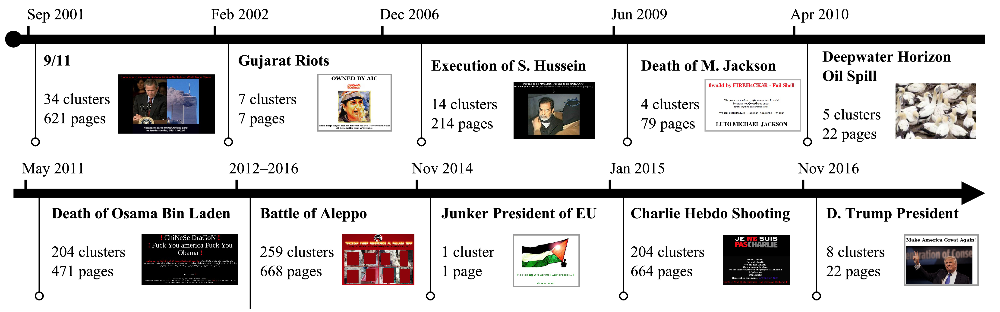
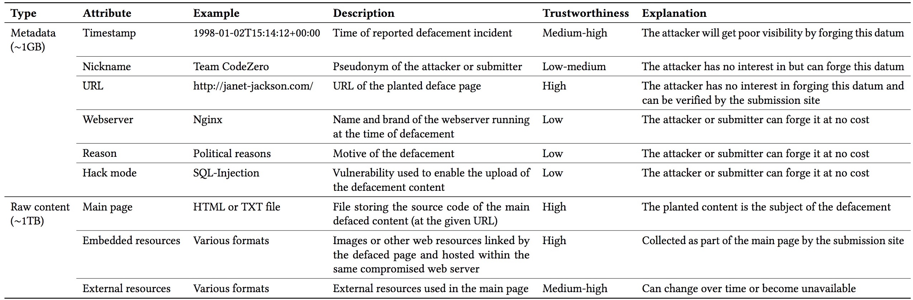
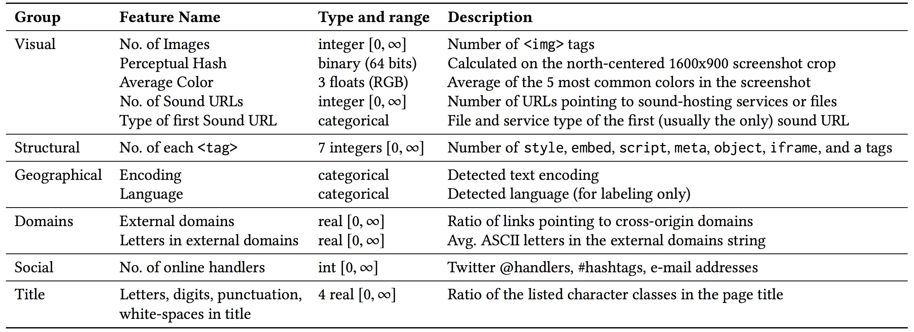
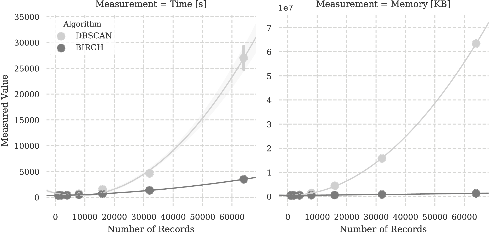

You’d be surprised (I was!) how much the modus operandi and the motivation
behind web defacement have evolved and mutated over the past ~20 years. From
attackers interested in pointing their finger to vulnerable websites, to modern
actors taking strong positions on real-world conflicts.



How do we know what we know about this phenomenon? Let's take a look!

## The Tool
Last year at [Black Hat US Arsenal](https://twitter.com/toolswatch) my
colleagues and I released [part of the source code of
DefPloreX](https://github.com/trendmicro/defplorex), the tool-chain that we use
to explore million of web-deface pages. DefPloreX is pretty flexible and, in
principle, it could be used to process any web page, for instance those planted
as a result of an attack, or to "cluster" together web pages of underground web
sites, and any other e-crime forensics task that requires to "make sense" out
of a large dataset of web pages.


DefPloreX ingests plain and flat tabular files (e.g., CSV files) containing
metadata records of web incidents under analysis (e.g., URLs), renders them and
obtains a copy of their resources with headless browsers (we tried basically
all of them, but then we settled with Chrome via
[Puppeteer](https://github.com/GoogleChrome/puppeteer)), extracts numerical
features, and stores the resulting data to an Elastic index. We've designed any
task to be distributed by default, using Celery to coordinate them.

On top of the Elastic back-end, I've cooked up a ReactJS-based web-app (which
as of now is not part of the open-source release, mainly because the code is
**very** messy) to interactively explore, query, and dig into the data. This
allows an analyst to easily investigate on campaigns, for example in
discovering websites targeted by the same campaign or attributing one or more
actors to the same hacking group. All of this without sacrificing the
interactivity aspect of the investigation.


If you want to see the web app in action, you can take yourself a 14 minutes coffee or tea break while watching this demo.


<div class="videoWrapper"><iframe src="https://www.youtube-nocookie.com/embed/DILbSXYpiMU" frameborder="0" allow="autoplay; encrypted-media" allowfullscreen></iframe></div>

### Distributed Data Processing

Normally, to take full advantage of Elastic's distributed data-processing
functionality, you need to resort to
[scripting](https://www.elastic.co/guide/en/elasticsearch/reference/current/modules-scripting.html).

Although scripting is quite powerful and handy for small data-manipulation
tasks, it's a bit cumbersome to deploy and handle requires; and, in addition,
it requires full access to the Elastic's client nodes. For example, if you need
to process all the documents in an Elastic index (e.g., to enrich them by
computing additional fields), you will have to choose one of the scripting
languages supported by Elastic, write a script, deploy it and run it. Needless
to say, your script will run within the context of the ES runtime, with all the
limitations that this implies. For example, should you need to use Python,
you're forced to use the Jython Java implementation of Python, which is not the
same as pure Python. For instance, some of the libraries that you may want to
use may not be supported, and so on. In other words, we don't want to depend on
the Elastic's scripting subsystem in our work :-)

Instead, we take a more "detached" approach. We decouple the data-processing
part, making it independent from the Elastic runtime and architecture, and rely
on ES exclusively as a data back-end to store, retrieve and modify JSON
documents. The coordination of the distributed computation is delegated to
a well-known and widely used distributed task queue:
[Celery](http://www.celeryproject.org/). The friendliness of Celery is
astonishing: from the programmer's perspective, all it requires is to write
your data-processing code by means of a function, and Celery will take care of
offloading the (expensive and long-running) computation to one of the available
workers.


For example, if you need to visit a web page with an automated headless
browser, all you need to do is to wrap your code into a function, let's say
`visit_page`, and decorate it with `@app.task` to inform Celery that this is
a task:

```
@app.task
def visit_page(url):
    result = long_running_process(url)

    return result
```

Later on in your code, all you need to do is to call the function (almost) as
you would normally do:

```
visit_page.delay(url)
```

The `.delay()` function indicates that the function call will not execute
immediately, but instead will be "pushed" into a task list, from which an
available worker will pull it and do the work.

On the other end of the task list, you can launch as many workers as you need,
by simply keeping the Celery daemon active:

```
$ celery worker --autoscale=6,64
```

Assuming a 64-core machine, this command spawns 6 concurrent processes, up to
64 when more workload comes in. And of course you can add as many workers as
needed, from a single computer with a few tenths of cores, to a full rack
distributed across the globe. In our deployment, we have 5 machines, with
a total of 128 cores. With these modest resources, we were able to visit the
entire collection of over 13 million web pages in a week. Adding more cores
would have made the analysis even faster.

### Document Transformations

From this moment on, we have a solid foundation to efficiently transform JSON
documents stored in the Elastic index. Therefore, we "encode" any operation
that we need to perform in DefPloreX by means of a few lines of Python code. For
example, we often need to "tag" JSON documents to mark those that have been
processed. To this end, as exemplified in this repository, we use the
`TagTransformer` transformation. As any other transform, this function receives one JSON
document and returns the newly added fields, or the modified fields.

```
class TagTransformer(Transformer):
    """
    Example transform to append tag to a record.
    """
    _name = 'tag'                   # unique name

    def __call__(self, doc, *args, **kwargs):
        doc = super(TagTransformer, self).__call__(
                doc, *args, **kwargs)

        tag = kwargs.get('tag')     # tag that we want to apply to the JSON

        if not tag:
            log.debug('No tags supplied, skipping')
            return []

        tags = doc.get('tags', [])  # get the 'tags' field from the existing JSON doc

        if tags:
            log.debug('Found tags: %s', tags)

        tags.append(tag)            # append the new tag
        tags = list(set(tags))      # remove duplicates

        log.debug('Updated tags: %s', tags)

        return dict(tags=tags)      # return the enriched JSON
```

The output of this transformation is automatically handled by our Elastic 
wrapper (see `backend.elastic.ESStorer`) and the
`transformer.Pipeline` class, which merges the new (partial) document with the
original one and saves it into the ES index. Actually, this is
performed in bulk: that is, every worker consumes and processes a given amount
of documents at each round (default is 1000). To summarize: given a query, we
enqueue all the IDs of the documents that match that query. The queue consumers
will pull 1000 IDs at a time, query Elastic for the respective documents,
transform them, and push them back on Elastic as update operations.

Other transformations that we have implemented (briefly explained in
the following) include for example visiting the web pages with an automated,
headless browser, extracting information from the visited web pages,
calculating numerical features, and so on. Every task is expressed by means of
a subclass of `Transformer`, which takes as input a document, and returns the
enriched or modified fields.

## The White Paper
With the help of our great colleagues at TrendLabs, we prepared a [white
paper](https://www.trendmicro.com/vinfo/us/security/news/cyber-attacks/web-defacements-exploring-the-methods-of-hacktivists)
that focuses on the major campaigns, and how DefPloreX helped explore them. In
particular, we look at 7 campaigns that have affected Israel, France,
India, Syria, Kosovo, and countries surrounding the South China Sea. We dig
into specific conflicts in those areas and the defacements that happened in the
aftermath.


To ~~feed our curiosity and~~~ help CERTs understand better the origin of these
attacks and modus-operandi of the groups, we also look how they are organized
(some are formed across continents, and some are a loose collection of local
hackers), as well as how their recruitment tools and the methods adopt.

## The ~~Devil~~ Answer is in the Details
You might be wondering how exactly the data-mining workflow works, what
features we use, what clustering algorithm and so on. For the impatient, here's a quick overview of the data that we process and the features that we extract:





So, now, how do we use these features for clustering?

I'm very thankful to Roberto Perdisci for the valuable insights that he
provided on this work about the machine-learning and data-mining part. What I'm
most thankful about, however, is the suggestion to use BIRCH, which I didn't
know before. I think this figure speaks by itself.



Impressive, huh?

## References

[@balduzzi_defplorexwp_tr_2018]

[@maggi_defplorex_2018]

[@balduzzi_defplorexbhus_talk_2017]
